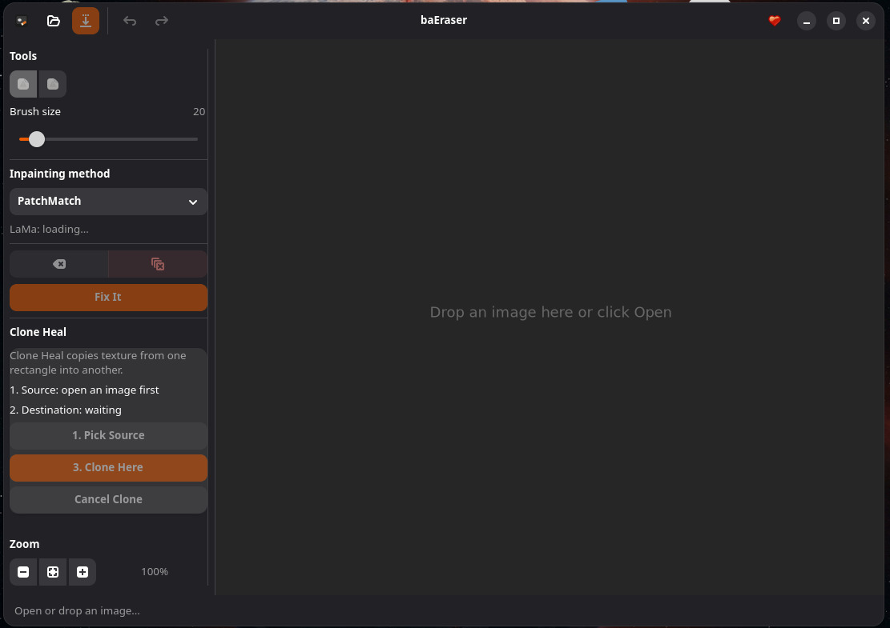
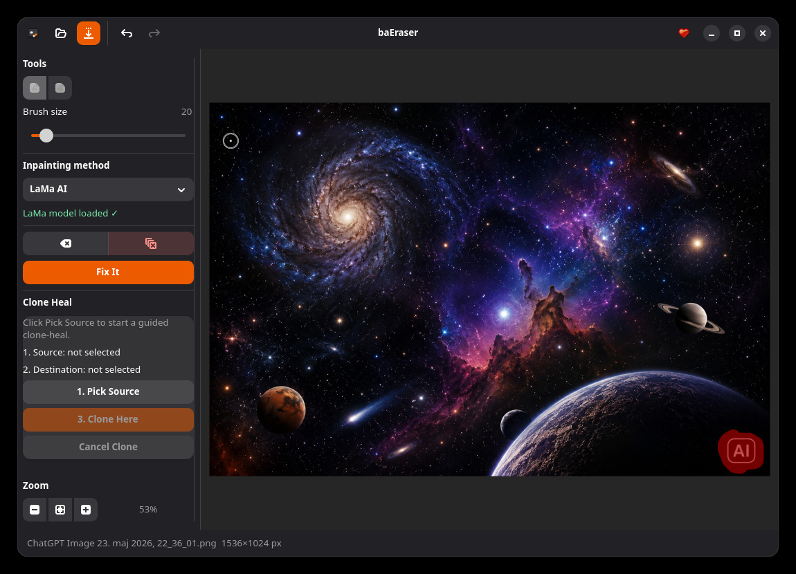
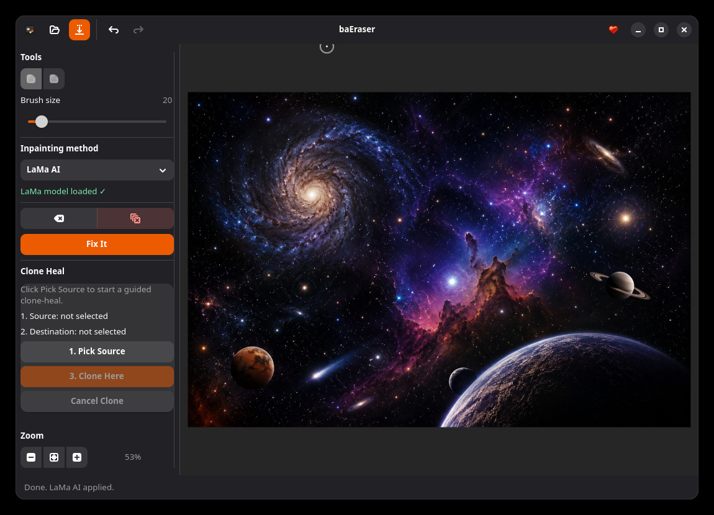
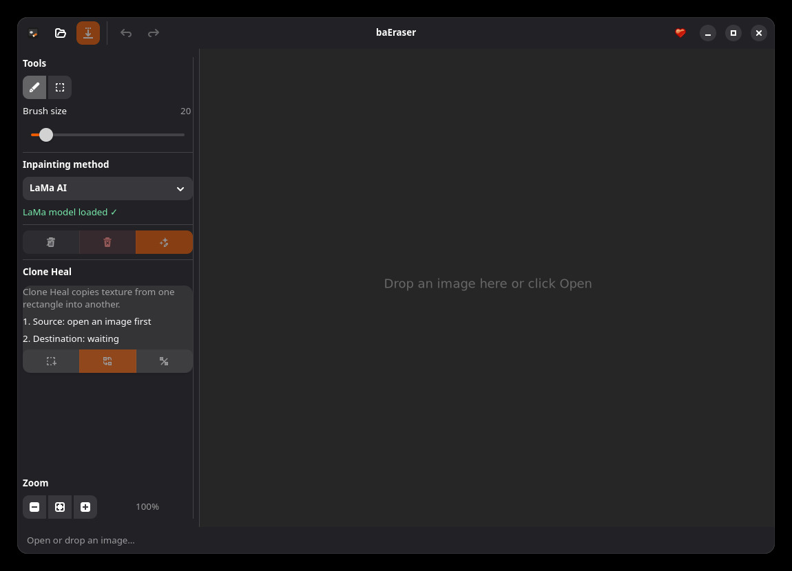
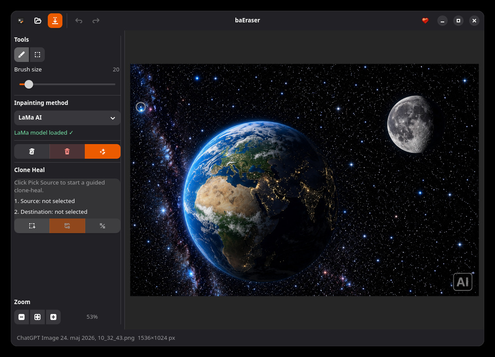
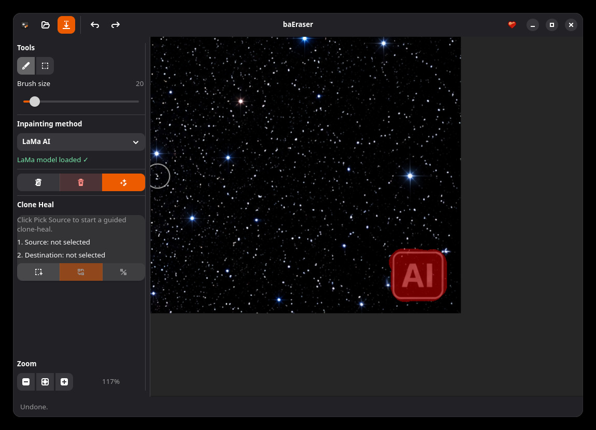
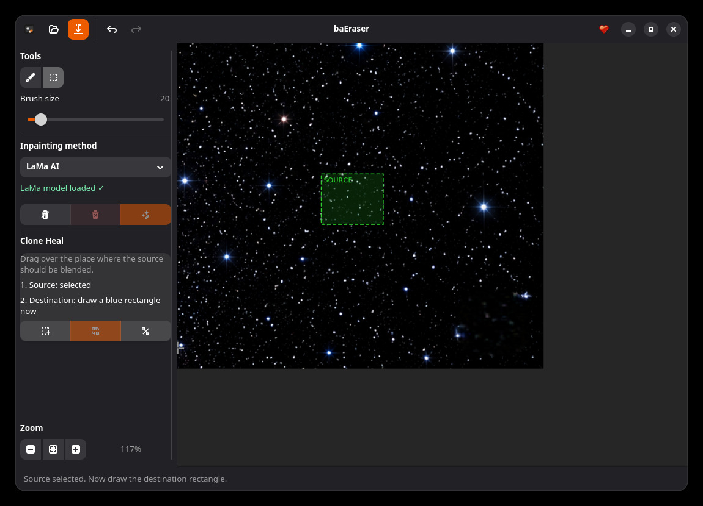
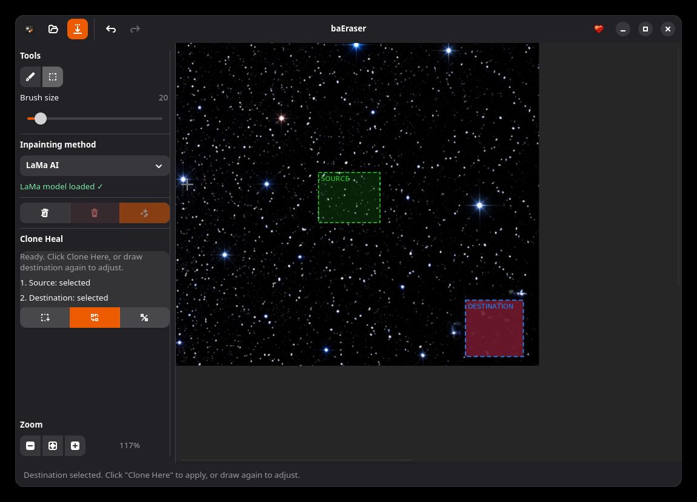
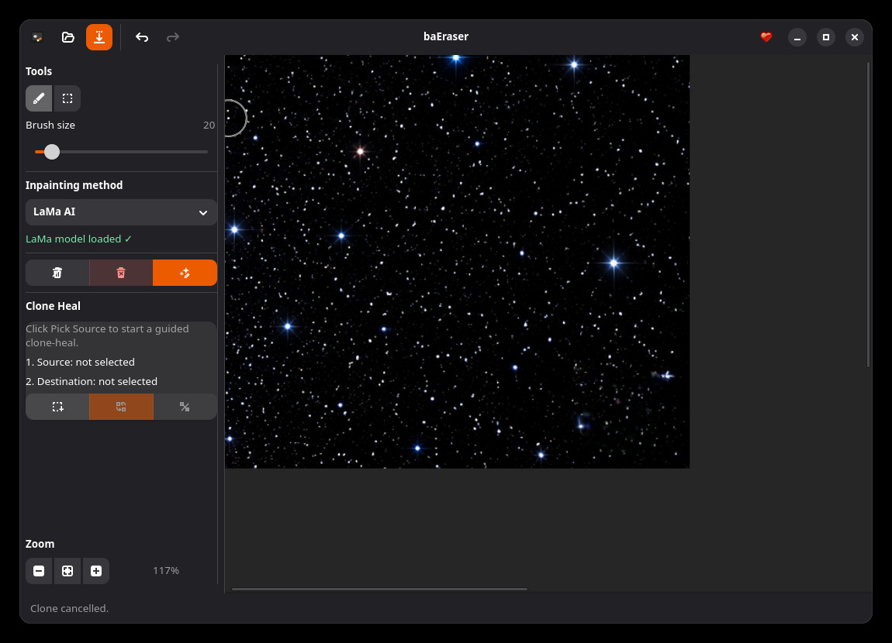

# baEraser

A GNOME image object eraser built with GTK4 + libadwaita.  
Draw a mask over an unwanted object and erase it using classical inpainting or AI (LaMa).

## Screenshots

| img1 | img2 |
|---|---|
|  |  |

| img3 | img4 |
|---|---|
|  |  |

| img5 | img6 |
|---|---|
|  |  |

| img7 | img8 |
|---|---|
|  |  |

| img9 | img10 |
|---|---|
|  |  |

| Result after watermark removal |
|---|
|  |

## Installation

### AppImage

```bash
chmod +x ./baEraser.AppImage
./baEraser.AppImage
```

### Flatpak (recommended)

**Install:**
```bash
flatpak install --user -y --bundle ./baEraser.flatpak
```

**Run:**
```bash
flatpak run si.generacija.baEraser
```

**Uninstall:**
```bash
flatpak uninstall --user si.generacija.baEraser
```

### Build from source

The build script checks the required system packages, downloads ONNX Runtime
and the LaMa model when missing, then builds the executable:

```bash
bash build.sh
./build/baEraser
```

Manual build is also available if the dependencies are already installed:

```bash
make -j$(nproc)
```

Required system dependencies: GTK4, libadwaita, OpenCV 4, pkg-config, g++, make.

## Inpainting methods

| Method | Best for |
|---|---|
| TELEA | Quick removal, small areas |
| Navier-Stokes | Smooth backgrounds |
| Multi-scale | Large areas |
| PatchMatch | Backgrounds and textures |
| LaMa AI | Best quality (requires ONNX model) |

## LaMa model

Flatpak and AppImage builds bundle every `.onnx` file found in `models/`.
For a source build, `build.sh` downloads a model automatically when none is
present. Manual download is also available:

```bash
bash models/download_lama.sh
```

At runtime baEraser searches for LaMa models in this order:

1. `BAERASER_MODEL_PATH`
2. `../models` relative to the binary
3. `./models` relative to the current working directory
4. `/usr/share/baEraser/models`
5. `$XDG_DATA_HOME/baEraser/models`

Supported bundled model names include:

- `inpainting_lama_2025jan.onnx`
- `lama_carve_fp32.onnx`
- `lama_fp32.onnx`
- `big-lama.onnx`

When LaMa is selected but fails at inference time, baEraser falls back to
PatchMatch and reports that fallback in the status bar.

## License

baEraser source code is licensed under the MIT License. See `LICENSE`.

Release bundles may include third-party components with their own licenses,
including GTK, libadwaita, OpenCV, ONNX Runtime, and downloaded LaMa ONNX
models. Check the upstream projects and bundled license files before
redistributing modified bundles.
